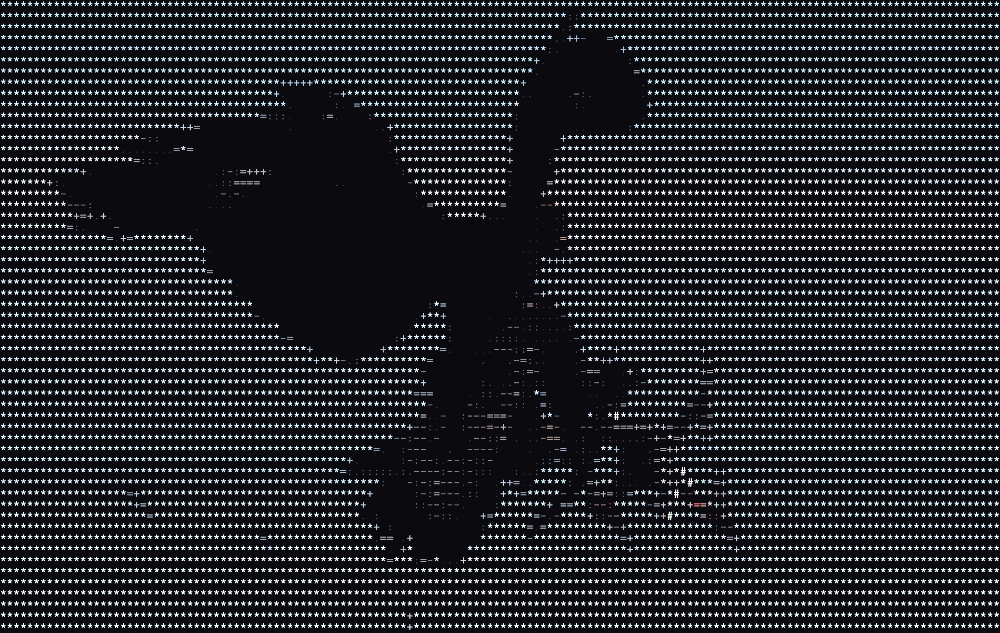

# Sky-Spy

<p align="center">
  
</p>

**Official OUI-SPY firmware for drone RemoteID detection and mapping**

Sky-Spy is one of the official firmware options for the [OUI-SPY hardware platform](https://github.com/colonelpanichacks/OUI-SPY). This specialized firmware detects and tracks drones broadcasting RemoteID via WiFi and Bluetooth Low Energy, outputting real-time JSON data for visualization with mesh-mapper.py.

## NEW: Dual-Band WiFi Support (2.4GHz + 5GHz)

Sky-Spy now supports the **XIAO ESP32-C5** with dual-band WiFi 6, enabling detection of drones broadcasting RemoteID on both 2.4GHz and 5GHz bands simultaneously. This future-proofs your detector as more drones adopt 5GHz RemoteID.

| Board | WiFi Bands | BLE | Recommended For |
|-------|------------|-----|-----------------|
| **XIAO ESP32-C5** | 2.4GHz + 5GHz | Yes | New builds (dual-band) |
| XIAO ESP32-S3 | 2.4GHz only | Yes | Existing OUI-SPY boards |

## OUI-SPY Firmware Family

Sky-Spy is part of the OUI-SPY firmware ecosystem:
- **[OUI-SPY Detector](https://github.com/colonelpanichacks/ouispy-detector)** - Multi-target BLE scanner with OUI filtering
- **[OUI-SPY Foxhunter](https://github.com/colonelpanichacks/ouispy-foxhunter)** - Precision proximity tracker for radio direction finding
- **[OUI-SPY UniPwn](https://github.com/colonelpanichacks/Oui-Spy-UniPwn)** - Unitree robot exploitation system
- **[Flock You](https://github.com/colonelpanichacks/flock-you)** - Flock Safety surveillance camera detection
- **[Sky-Spy](https://github.com/colonelpanichacks/Sky-Spy)** - Drone RemoteID detection (this firmware)

**What Makes Sky-Spy Different:**
- Targets OpenDroneID protocol (ASTM F3411) instead of general BLE devices
- **Dual-band WiFi scanning** (2.4GHz + 5GHz) on ESP32-C5
- WiFi promiscuous mode scanning for WiFi-based RemoteID broadcasts
- JSON output format for mesh-mapper.py real-time visualization
- Extracts GPS coordinates, altitude, speed, heading from drone telemetry
- Tracks operator/pilot location and drone identification
- Multi-drone tracking (up to 8 simultaneous)

Like all OUI-SPY firmware, Sky-Spy features audio alerts with a non-blocking buzzer implementation running on a dedicated FreeRTOS task.

## Hardware Requirements

### OUI-SPY Board (Recommended)
**Get the official hardware:** [Tindie](https://www.tindie.com) | [colonelpanic.tech](https://colonelpanic.tech)

The OUI-SPY board is a ready-to-use platform with:
- Integrated buzzer with PWM control
- Built-in antenna with external antenna option
- USB-C power and programming
- Compact PCB design with sick artwork
- Compatible with both ESP32-S3 and ESP32-C5 XIAO modules

### Compatible Development Boards

- **Seeed Studio XIAO ESP32-C5** (Recommended - Dual-Band)
  - ESP32-C5 RISC-V MCU
  - **WiFi 6 dual-band (2.4GHz + 5GHz)**
  - Bluetooth 5 (LE) + IEEE 802.15.4
  - USB-C connectivity
  - [Buy from Seeed Studio](https://www.seeedstudio.com/Seeed-Studio-XIAO-ESP32C5-p-6609.html)
  
- **Seeed Studio XIAO ESP32-S3** (Legacy - Single-Band)
  - ESP32-S3 dual-core MCU @ 240MHz
  - 8MB Flash, 8MB PSRAM
  - WiFi 2.4GHz & Bluetooth 5.0 (LE)
  - USB-C connectivity

### Buzzer Connection
Both boards use the same physical pin (D2) for OUI-SPY PCB compatibility:

| Board | Physical Pin | GPIO | LED GPIO |
|-------|--------------|------|----------|
| ESP32-C5 | D2 | GPIO4 | GPIO8 |
| ESP32-S3 | D2 | GPIO3 | GPIO21 |

- **Type:** Passive buzzer (requires PWM signal)
- **Connection:** Buzzer positive to D2, negative to GND
- **Optional:** Add 100Ω resistor in series for volume control

## Features

### Drone Detection
- **Triple-Protocol Scanning:**
  - WiFi 2.4GHz promiscuous mode (802.11 beacon/NAN frames)
  - WiFi 5GHz promiscuous mode (ESP32-C5 only)
  - Bluetooth Low Energy (BLE) advertisements
- **Seamless Dual-Band Operation:** Fast channel hopping (~180ms cycle) ensures no missed detections
- **OpenDroneID Protocol Support:**
  - Basic ID (drone serial/CAA registration)
  - Location data (GPS coordinates, altitude, speed, heading)
  - System data (operator location)
  - Operator ID
- **Multi-Drone Tracking:** Simultaneously track up to 8 drones

### Dual-Band Channel Coverage (ESP32-C5)

| Band | Channels | Dwell Time | Purpose |
|------|----------|------------|---------|
| 2.4GHz | Channel 6 | 30ms | WiFi NAN RemoteID standard |
| 5GHz | 149, 153, 157, 161, 165 | 30ms each | UNII-3 band RemoteID |
| BLE | All | Continuous | Bluetooth RemoteID |

Total cycle time: ~180ms (samples each channel multiple times per second)

### Audio Alerts (Non-Blocking)
- **Detection Alert:** 3 quick high-pitched beeps (1000 Hz) on first detection
- **Heartbeat:** Double beep (600 Hz) every 5 seconds while drone is in range
- **Auto-Stop:** Heartbeat stops after 7 seconds with no drone detected
- **Zero Latency:** Dedicated FreeRTOS task ensures buzzer never delays detection

### Thread-Safe Architecture
- **ISR-Safe Design:** All callbacks use critical sections for atomic flag updates
- **Race-Free Operation:** Mutex protection for all shared variables
- **Multi-Core Support:**
  - **ESP32-S3:** Dual-core task distribution
  - **ESP32-C5:** Single-core RISC-V with optimized scheduling

## Installation

### Prerequisites
1. **PlatformIO IDE** (VS Code extension) or **PlatformIO Core**
2. **USB-C cable** for programming and serial communication
3. **Passive buzzer** (optional, for audio alerts)

### Setup Steps

1. **Clone or download this repository**
   ```bash
   git clone https://github.com/colonelpanichacks/Sky-Spy.git
   cd Sky-Spy
   ```

2. **Install dependencies** (automatic via PlatformIO)
   ```bash
   pio pkg install
   ```

3. **Build firmware**
   ```bash
   # For ESP32-C5 (dual-band - recommended)
   pio run -e seeed_xiao_esp32c5
   
   # For ESP32-S3 (single-band - legacy)
   pio run -e seeed_xiao_esp32s3
   ```

4. **Flash to device**
   ```bash
   # ESP32-C5 (dual-band)
   pio run -e seeed_xiao_esp32c5 -t upload
   
   # ESP32-S3 (single-band)
   pio run -e seeed_xiao_esp32s3 -t upload
   ```

5. **Monitor serial output**
   ```bash
   pio device monitor
   ```

## Usage

### Serial Output Format

The device outputs JSON data at **115200 baud** via USB serial. Each detected drone generates:

```json
{
  "mac": "aa:bb:cc:dd:ee:ff",
  "rssi": -45,
  "band": "5GHz",
  "channel": 149,
  "drone_lat": 37.7749,
  "drone_long": -122.4194,
  "drone_altitude": 120,
  "pilot_lat": 37.7750,
  "pilot_long": -122.4195,
  "basic_id": "1234567890ABCDEF"
}
```

### Field Descriptions
| Field | Description |
|-------|-------------|
| `mac` | Drone's MAC address (WiFi or BLE) |
| `rssi` | Signal strength in dBm (closer = higher) |
| `band` | Detection source: `"2.4GHz"`, `"5GHz"`, or `"BLE"` |
| `channel` | WiFi channel (0 for BLE detections) |
| `drone_lat/drone_long` | Current drone GPS coordinates |
| `drone_altitude` | Altitude above mean sea level (meters) |
| `pilot_lat/pilot_long` | Operator/takeoff location |
| `basic_id` | Drone serial number or registration ID |

### Status Messages
```json
{"status":"active","mode":"dual-band","bands":["2.4GHz","5GHz","BLE"]}
```
Sent every 60 seconds to confirm device operation.

### Integration with mesh-mapper.py

This scanner is designed as a USB serial data source for the mesh-mapper.py visualization tool:

1. **Connect scanner** via USB
2. **Run mesh-mapper.py** with appropriate serial port:
   ```bash
   python mesh-mapper.py --port /dev/cu.usbmodem1101   # macOS
   python mesh-mapper.py --port COM3                   # Windows
   python mesh-mapper.py --port /dev/ttyUSB0           # Linux
   ```
3. **View real-time drone positions** on the map interface

## Audio Alert Behavior

### Detection Sequence
1. **Drone detected** → 3 quick beeps (150ms each @ 1000 Hz)
2. **Stays in range** → Double beep every 5 seconds (100ms each @ 600 Hz)
3. **Out of range** → Heartbeat stops after 7 seconds of no detection

### Disabling Buzzer
Comment out the buzzer task creation in `main.cpp`:
```cpp
// xTaskCreate(buzzerTask, "BuzzerTask", 4096, NULL, 1, NULL);
```

## Technical Details

### Detection Methods

**WiFi Dual-Band Scanning (ESP32-C5):**
- Fast channel hopping between 2.4GHz and 5GHz bands
- 30ms dwell time per channel for optimal packet capture
- Captures beacon frames and NAN action frames
- Parses OpenDroneID vendor-specific information elements

**WiFi Single-Band Scanning (ESP32-S3):**
- Fixed on channel 6 (WiFi NAN RemoteID standard)
- Captures beacon frames and NAN action frames
- Parses OpenDroneID vendor-specific information elements

**BLE Scanning (Both Boards):**
- Active scanning with 100ms interval
- Monitors ASTM F3411 RemoteID advertisements
- Service UUID: 0xFFFA (RemoteID identifier)
- 1-second scan duration with continuous operation

### FreeRTOS Task Architecture

**ESP32-C5 (Single-Core RISC-V):**
```
┌─────────────────────────────────────────────────────┐
│              Sky-Spy ESP32-C5                       │
├─────────────────────────────────────────────────────┤
│  Channel Hop Task (High Priority)                   │
│  ├─ 2.4GHz Ch6   ─┐                                 │
│  ├─ 5GHz Ch149    │                                 │
│  ├─ 5GHz Ch153    ├──► Promiscuous Callback ──┐     │
│  ├─ 5GHz Ch157    │    (NAN + Beacon frames)  │     │
│  ├─ 5GHz Ch161    │                           │     │
│  └─ 5GHz Ch165  ──┘                           │     │
│                                               ▼     │
│  BLE Scan Task ─────────────────────────► Print ──► │ USB JSON
│  Buzzer Task                               Queue    │
│  Main Loop (Heartbeat Monitor)                      │
└─────────────────────────────────────────────────────┘
```

**ESP32-S3 (Dual-Core):**
```
Core 0:                         Core 1:
┌──────────────────┐           ┌──────────────────┐
│ WiFi Process     │           │ BLE Scan Task    │
│ (Channel 6)      │           │ (1s intervals)   │
└────────┬─────────┘           └────────┬─────────┘
         │                              │
         └────────────┬─────────────────┘
                      │
            ┌─────────▼──────────┐
            │  ISR Callbacks     │
            │  (Set Flags)       │
            └─────────┬──────────┘
                      │
         ┌────────────┼────────────┐
         │            │            │
    ┌────▼─────┐ ┌───▼──────┐ ┌──▼────────┐
    │ Printer  │ │ Buzzer   │ │ Main Loop │
    │ Task     │ │ Task     │ │ (Monitor) │
    └──────────┘ └──────────┘ └───────────┘
```

## Development

### Project Structure
```
Sky-Spy/
├── src/
│   ├── main.cpp           # Main application code
│   ├── opendroneid.h      # OpenDroneID protocol definitions
│   ├── opendroneid.c      # Protocol parsing functions
│   ├── odid_wifi.h        # WiFi-specific RemoteID structures
│   └── wifi.c             # WiFi helper functions
├── include/               # Additional headers
├── lib/                   # Project-specific libraries
├── test/                  # Unit tests
├── platformio.ini         # Build configuration
├── mesh-mapper.py         # Visualization tool
└── README.md              # This file
```

### Building for Different Boards

**ESP32-C5 (Dual-Band - Recommended):**
```bash
pio run -e seeed_xiao_esp32c5 -t upload
```

**ESP32-S3 (Single-Band - Legacy):**
```bash
pio run -e seeed_xiao_esp32s3 -t upload
```

### Customization

**Adjust Channel Dwell Time (ESP32-C5):**
```cpp
#define DWELL_TIME_MS 30  // Milliseconds per channel (default: 30)
```

**Modify 5GHz Channels:**
```cpp
static const uint8_t channels_5ghz[] = {149, 153, 157, 161, 165};
```

**Adjust Heartbeat Interval:**
```cpp
if (current_millis - last_heartbeat >= 5000) {  // Change 5000 to desired ms
```

**Modify Beep Frequencies:**
```cpp
#define DETECT_FREQ 1000          // Detection alert frequency (Hz)
#define HEARTBEAT_FREQ 600        // Heartbeat frequency (Hz)
#define DETECT_BEEP_DURATION 150  // Beep duration (ms)
#define HEARTBEAT_DURATION 100    // Heartbeat duration (ms)
```

## Troubleshooting

### No Drones Detected
- **Check antenna:** Ensure device has good WiFi/BLE reception
- **Verify RemoteID compliance:** Not all drones broadcast RemoteID
- **Check region:** RemoteID may not be mandated in your area
- **Distance:** Typical range is 200-500m depending on conditions
- **5GHz range:** 5GHz has shorter range than 2.4GHz

### Serial Port Not Found
```bash
# List available ports
pio device list

# Specify port manually
pio device monitor --port /dev/cu.usbmodem1101
```

### Build Errors
```bash
# Clean and rebuild
pio run -e seeed_xiao_esp32c5 -t clean
pio run -e seeed_xiao_esp32c5
```

### Buzzer Not Working
- **Check wiring:** D2 pin to buzzer positive, GND to buzzer negative
- **Verify buzzer type:** Must be passive buzzer (not active)
- **Test with multimeter:** Should see PWM signal on D2 during beeps
- **Check serial output:** Should see "Buzzer initialized" message

## Drones Using 5GHz RemoteID

Most consumer drones currently use 2.4GHz, but 5GHz adoption is growing:

**Primarily 2.4GHz:**
- DJI (Mavic, Mini, Air, Phantom series)
- Most Autel drones
- Most consumer drones

**Known/Potential 5GHz:**
- Skydio (S2, X2, X10) - enterprise drones
- Parrot ANAFI series - dual-band capable
- Commercial/enterprise drones
- Newer drones with WiFi 6

The ESP32-C5 dual-band scanning ensures you catch drones regardless of which band they use.

## Legal & Safety

### Regulations
- This device is a **passive receiver** only
- Does not transmit or interfere with drone operations
- Complies with FCC Part 15 (unlicensed receiver)
- **Check local laws** regarding RF monitoring

## Credits & License

### Based On
- **[OUI-SPY by Colonel Panic](https://github.com/colonelpanichacks/OUI-SPY)** - Original BLE scanner with buzzer alerts and FreeRTOS architecture
- **OpenDroneID:** Open-source RemoteID protocol implementation
- **ASTM F3411:** Standard Specification for Remote ID and Tracking
- **[Hackster.io Article](https://www.hackster.io/news/colonel-panic-s-oui-spy-is-a-slick-bluetooth-low-energy-scanner-or-a-foxhunting-handset-c16927adad71)** - OUI-SPY project overview

### OUI-SPY Firmware Ecosystem
Sky-Spy is an **official OUI-SPY firmware** from [colonelpanichacks](https://github.com/colonelpanichacks). The OUI-SPY platform supports multiple firmware options:

- **[OUI-SPY Main Repository](https://github.com/colonelpanichacks/OUI-SPY)** - Hardware info and firmware overview
- **[OUI-SPY Detector](https://github.com/colonelpanichacks/ouispy-detector)** - Multi-target BLE scanner with web configuration
- **[OUI-SPY Foxhunter](https://github.com/colonelpanichacks/ouispy-foxhunter)** - RSSI-based proximity tracking for direction finding
- **[OUI-SPY UniPwn](https://github.com/colonelpanichacks/Oui-Spy-UniPwn)** - Unitree robot security assessment tools
- **[Flock You](https://github.com/colonelpanichacks/flock-you)** - Surveillance camera detection system
- **[Sky-Spy](https://github.com/colonelpanichacks/Sky-Spy)** - Drone RemoteID detection (this project)

All OUI-SPY firmware shares the same thread-safe, non-blocking buzzer architecture and professional FreeRTOS task design.

### Dependencies
- **Arduino Framework:** ESP32 Arduino Core
- **ArduinoJson:** v6.18.5+
- **ESP-IDF:** v5.x
- **BLE Libraries:** ESP32 BLE Arduino

### License
This project is provided as-is for educational and research purposes. Inherits licensing from:
- OUI-SPY project (original hardware/software design)
- OpenDroneID libraries (Apache 2.0)

## Support

For issues, questions, or contributions:
- **OUI-SPY Hardware:** Refer to [Colonel Panic's repository](https://github.com/colonelpanichacks/OUI-SPY)
- **Drone RemoteID:** Check this project's documentation
- Review troubleshooting section above
- Provide serial monitor output when reporting bugs
- Include board type and PlatformIO version
